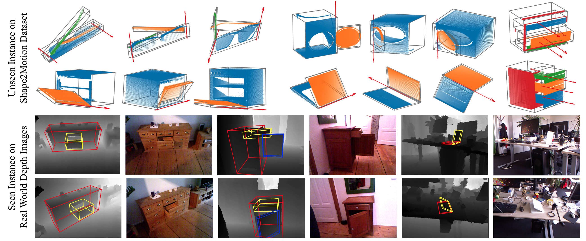
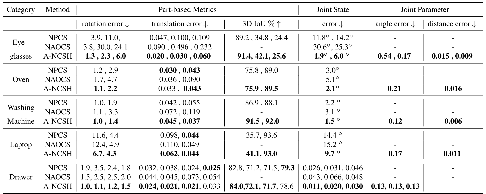
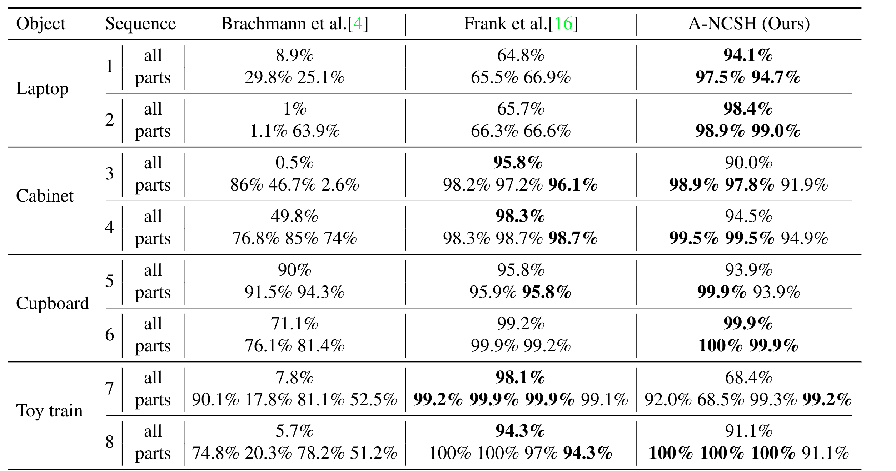

# Category-Level Articulated Object Pose Estimation

Xiaolong Li, He Wang, Li Yi, Leonidas Guibas, A. Lynn Abbott, Shuran Song. [arXiv:xxx](https://arxiv.org/), 2019.
implemented in Tensorflow, **coming soon**

Introduction
-------------------

This repository contains the implementation of **A-NSCH**, a simple and efficient neural architecture for pose estimation of common articulated objects.

The following figure shows the shared representation our model learns from depth observation. This hierarchy consists of a two-level hierarchy: at the leaf level, it uses Normalized Part Coordinate Space (NPCS)to represent each individual part; at the root level, it uses Normalized Articulated Object Coordinate Space (NAOCS), which is a singlecoordinate space that transforms all the NPCS-based parts to represent a complete articulated object in a pre-defined rest state.

  

## Qualitative Results

  

## Quantitative Results

### Synthetic Data

Performance comparison on unseen object instances from [Shape2Motion](http://motiondataset.zbuaa.com) dataset. 
We show that our proposed hierarchical representation gets significant better results compared to two of our baselines on pose estimation and joint state prediction.

### Real Data

Quantitative results of different approaches on [ICCV2015 Articulated Object Challenge](https://hci.iwr.uni-heidelberg.de/vislearn/iccv2015-articulation-challenge/).

