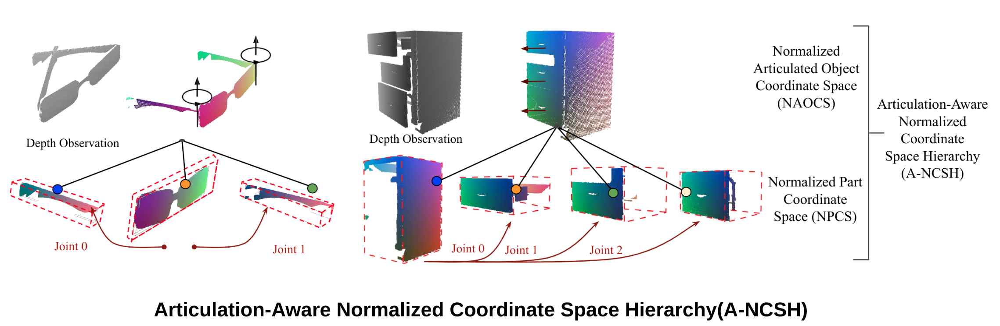

## Category-Level Articulated Object Pose Estimation(CVPR 2020)

-------------------
### Overview
This repository contains the implementation of **ANSCH**, a canonical representation for different articulated objects in a given category, together with an efficient neural network for  pose estimation and joints regression of articulated objects from a single depth point cloud.
<p align="center">  </p>
&nbsp;&nbsp;&nbsp;&nbsp;&nbsp;&nbsp;&nbsp;&nbsp;&nbsp;&nbsp;<br>

[Paper](https://arxiv.org/abs/1912.11913)&nbsp; [Project](https://articulated-pose.github.io/)

#### Citing

If you find this code useful in your work, please consider citing:
```
@article{li2019category,
  title={Category-Level Articulated Object Pose Estimation},
  author={Li, Xiaolong and Wang, He and Yi, Li and Guibas, Leonidas and Abbott, A Lynn and Song, Shuran},
  journal={Proceedings of the IEEE Conference on Computer Vision and Pattern Recognition},
  year={2020}
}
```
### Content
- [Updates](#Updates)
- [Setup](#Setup)
- [Quick Start](#Quick-Start)
- [Dataset](#Dataset)
- [Pretrained models](#Pretrained-Models)
- [Training](#Training)
- [Evaluation](#Evaluation)
- [Visualization](#Visualization)

<p align="center">  </p>

## Updates
- :heavy_check_mark: [2021/02/01] release the [preprocessed synthetic dataset](https://drive.google.com/drive/folders/1lGBHFoI7AmVBEsgxfGCm8Lb_X78y_glA?usp=sharing) for 4 different categories, use [rclone](https://github.com/rclone/rclone) for Google Drive downloads

## Setup
This implementation has been tested on Ubuntu 16.04 LTS, and CentOS 7.0, make sure CUDA and CUDNN are installed.

* Two configurations have been tested:
    - Tensorfow 1.10, CUDA 9.0, and cudnn 7.1;
    - TensorFlow 1.12.0, CUDA 9.0 and cuDNN 7.4;

* Clone the repository
```sh
git clone https://github.com/dragonlong/articulated-pose.git
```

* Setup python environment
```sh
conda create -n articulated-pose python=3.6
source activate articulated-pose
pip install -r requirements.txt
sh compile_op.sh
```

## Quick-Start
###  Online Codelab demos
You could check our online [CodeLab demo](https://colab.research.google.com/drive/1z3kO6gyK-awyCOZfrWIr7z9MuR2Ufghv) to reproduce some of our results.

## Dataset

You could simply download our [pre-processed dataset](https://drive.google.com/open?id=1lGBHFoI7AmVBEsgxfGCm8Lb_X78y_glA) to **./dataset** folder. Below is a step-by-step tutorial on rendering
your dataset using [Pybullet](https://pybullet.org/wordpress/), here we take eyeglasses in [shape2motion](https://arxiv.org/abs/1903.03911) for example:

* Setup global path infos
```sh
  vim global_info.py
```
* Download shape2motion dataset
```sh
bash download_shape2motion.sh
```

* Create URDF
```sh
cd tools && python json2urdf.py
```
* Rendering Data
```sh
python render_synthetic.py --dataset='shape2motion' --item='eyeglasses' --num=30 --cnt=31 --pitch="-90,5" --roll="-10,10" --yaw="-180,180" --min_angles="0,0" --max_angles="90,90"
```

* Preprocessing
```sh
python preprocess_data.py --dataset='shape2motion' --item='eyeglasses'
```

* Train/test split and visualization
```sh
cd ../lib && python dataset.py --item=eyeglasses --dataset=shape2motion --is_split --show_fig
```

## Pretrained-Models
Please download our pretrained models from [here](https://drive.google.com/open?id=1JaIuz7kJfg7dd5GMGDfikartG7GPOek0)(updated on April 22nd, 2020), and put into the **./results/model/** folder. Below are links to pretrained models of different categories, results might be slightly different with these checkpoints as we updated our training.

[eyeglasses](https://drive.google.com/open?id=1z9lwwUGeal7iMPUwvAqP5aRpJDrnmGTe)

[oven](https://drive.google.com/open?id=1oW35WuosjRWEc7Bc5xAVd86we80c4bjx)

[washing machine](https://drive.google.com/open?id=1BndF_vsFpOd6pA78s4N_RKcVbvM7NAa5)

[laptop](https://drive.google.com/open?id=1o0aSf3lW6RdXIj6A57yRWiqzid7w7vXN)

[drawer](https://drive.google.com/open?id=1y1qg8wH322Wlox-1tMeu-IehTe4HwU6b)

## Training
To train the network
```shell
python main.py --item='eyeglasses' --nocs_type='ancsh' --gpu='0'
python main.py --item='eyeglasses' --nocs_type='npcs' --gpu='1'
```

## Evaluation
To generate estimation and evaluation results on per-part pose estimation, 3D iou, joint states, and joint parameters, you could simply run: bash evaluation.sh. Below is a detailed step by step tutorial:
### 1. Prediction
```sh
python main.py --item='eyeglasses' --nocs_type='ancsh' --test
```
```sh
python main.py --item='eyeglasses' --nocs_type='npcs' --test
```
### 2. Evaluation

#### 2.1 post-processing
```sh
cd evaluation
python compute_gt_pose.py --item='eyeglasses' --domain='unseen' --nocs='ANCSH' --save

# npcs baseline estimation
python baseline_npcs.py --item='eyeglasses' --domain='unseen' --nocs='NPCS'

# run non-linear optimization over test group
python pose_multi_process.py --item='eyeglasses' --domain='unseen'
```
#### 2.2 evaluation
```sh
# pose & relative
python eval_pose_err.py --item='eyeglasses' --domain='unseen' --nocs='ANCSH'

# 3d miou estimation
python compute_miou.py --item='eyeglasses' --domain='unseen' --nocs='ANCSH'

# evaluate joint estimations
python eval_joint_params.py --item='eyeglasses' --domain='unseen' --nocs='ANCSH'
```

## Visualization
Please check the online demo for further visualizations.

Demo with point cloud rendering is inspired by: https://github.com/zekunhao1995/PointFlowRenderer.
